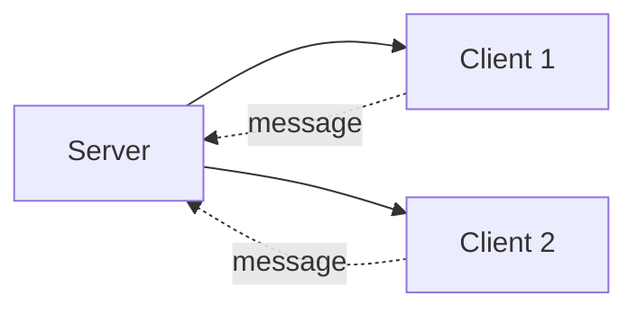

# Server-Client using Socket.io

## Running...
1. `npm install`
2. Run server. `npm run start-server`
3. Run client 1. `npm run start-client1`
4. Run client 2. `npm run start-client2`

```mermaid
flowchart LR
    Server

    Client1["Client 1"]
    Client2["Client 2"]

    Client1 .->|message| Server
    Client2 .->|message| Server

    Server --> Client1
    Server --> Client2
```
