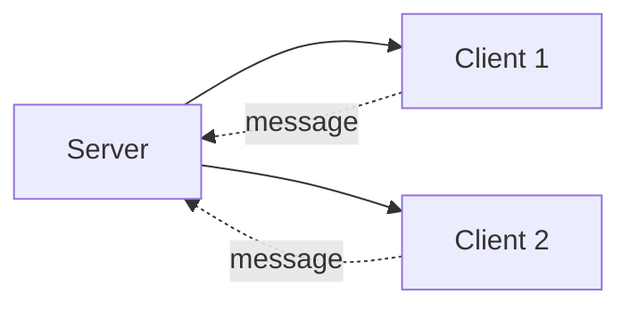

```mermaid
flowchart LR
    Server

    Client1["Client 1"]
    Client2["Client 2"]

    Client1 .->|message| Server
    Client2 .->|message| Server

    Server --> Client1
    Server --> Client2
```